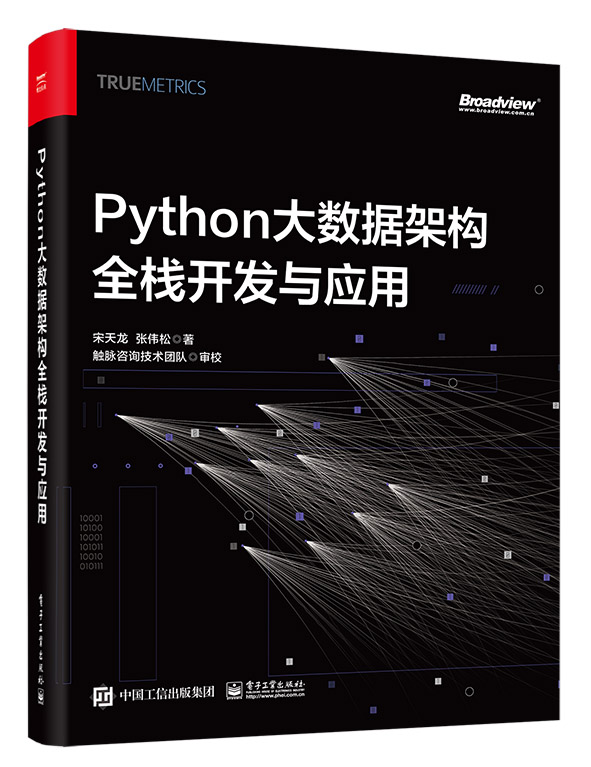

# [书籍]Python大数据架构全栈开发与应用

## 📖 前言与简介
内 容 简 介
本书介绍了如何使用Python实现企业级的大数据和人工智能的全栈式开发、设计和编程工作，涉及的知识点包括架构设计、数据采集、数据同步、消息队列、关系型数据库、NoSQL数据库、批处理、流处理、图计算、数据挖掘与分析、人工智能等。
本书既深入浅出地介绍了不同技术组件的基本原理，又通过详细对比介绍了如何根据不同场景选择最佳实践技术方案，并通过代码实操帮助读者快速掌握常用技术应用过程，最后通过项目案例介绍了如何将所学知识应用于实际业务场景中。
本书有技术理论、技术选型对比、实战代码和应用落地示例，视野开阔、紧跟技术潮流、落地性强。
嵌入式实时操作系统（RTOS）是面向微控制器类应用的嵌入式人工智能与物联网终端的重要工具和运行载体，它的种类繁多。但是其共性是一致的，就是多线程编程，内核
为什么要写这本书
在企业技术开发实践中，往往存在众多技术栈。开发者可根据开发需求，选择不同技术栈及技术栈的组合，以快速、高效、稳健地开发应用程序和系统。
在众多技术栈中，Python由于拥有众多独特优势，已经成为事实上的核心开发语言之一。围绕Python的开发生态、组件、第三方库也异常丰富，因此能够适应几乎所有的开发需求和场景。
Python技术栈的独特优势如下。
开源特性。开源意味着可以应用于任何用途且无须付费，包括Python自身，以及第三方库、组件等。
多平台支持。Python支持Windows、Linux、Mac OS等多种系统和平台，并且是Linux和UNIX系统的预置语言。这种特性对跨系统、跨环境、跨应用、异构环境下的开发、迁移、部署等工作至关重要。
高效的开发效率。Python语言语法简单、优美，因此更加易于开发。在相同的功能需求下，Python的开发效率非常高，这意味着在相同时间内，Python可以完成更多的开发项目。
数据科学与人工智能生态。Python拥有众多的数据科学和人工智能框架、系统、库，这使得它成为最受欢迎的数据科学工作语言之一。
胶水特性。从功能上看，Python可以开发任何应用程序，但这并不意味着Python在所有开发场景下都是最优选择。而Python可以通过多种API、集成库来连接、调用不同的语言、系统和开发框架，这使得Python开发者可以在最合适的场景下选择最合适的技术组件，如统计工作调用R语言、使用PySpark在Spark框架上开发大数据应用等。
在企业的众多开发应用领域中，以下几个领域是Python的最佳实践和应用场景。
数据科学和人工智能。在数据科学和人工智能领域，Python几乎是最流行、工业界使用最广泛的开发语言。除此之外，几乎没有其他选择。例如，TensorFlow、Pytorch等深度学习框架就是基于Python开发实现封装的。
大数据开发。企业中流行的大数据框架，如Hadoop、Spark、Flink等均提供了Python API，这使得Python开发者可以通过Python程序实现大数据系统和应用的开发，如使用Spark开发推荐系统、精准营销投放系统等。
数据分析。数据分析、统计学等是各个企业数据化运营必不可少的技术支撑。Python的Pandas、SciPy、Statistics、Bokeh、PyECharts、Matplotlib等库提供了众多数据统计分析、数据处理、数据可视化等功能，简单易用、美观大方。
IT运维。Python可以通过多种方式与系统交互，基于众多的Python第三方库提供了丰富的、针对集群的环境配置、程序部署、持续集成、测试等功能，如Ansible的自动化脚本、psutil的服务器监控等。另外，像AWS等云服务商也都提供了Python相关库开发来管理云服务和基础设置。
Web开发。在Web开发领域，Django、Flask是使用较广泛的开发框架，只需少量代码即可快速构建Web应用服务。
网络爬虫。在网络爬虫方面，Python提供的Requests、Httpx、Scrapy、Pyspider等众多HTTP库及分布式爬虫框架可以满足多种数据抓取需求。配合Python的多线程等工作模式，抓取效率非常高。
在图书市场，已经出版了众多关于Python的技术类图书，但大多数都在介绍技术细节，如框架、入门代码、参数、简单示例等，往往让普通的开发者大多只关注技术实现和细节，即如何编程及如何更好地编程。长此以往就会出现“一叶障目，不见泰山”的问题。
在高级开发者和架构师视角中，他们首先关注的是场景和需求是什么，什么框架和组件最合适，技术迭代和升级如何实现，如何实现应用扩展和二次开发，如何平衡技术性能、稳定性、开发效率、运维便利性、技术趋势及成本等。本书的核心价值就在于此。
我希望开发者既拥有全面的视野和格局，又拥有技术编程和开发落地的本领。这也是写作本书的初衷。
读者对象
本书适合高等院校的在校学生、数据运营人员、Python开发者，以及希望转型为Python开发者的读者使用。
高等院校的在校学生。在出校门前就掌握Python的核心技能能帮助学生更好地在激烈的职场竞争中脱颖而出。尤其在从事与数据分析、数据学习和人工智能相关的工作时，Python是必须要掌握的技能。
数据运营人员。企业的数据运营人员包括数据专员、数据分析师、DBA、业务分析师等。在数据运营中，往往涉及大量的数据收集、处理、分析、可视化等工作，使用Python能满足更多的场景、更大的数据量级、更复杂的数据格式的处理需求。
Python开发者。作为一名Python开发者，拥有全栈技能不仅能帮助自己提升技能，还能在职业成长路上更好地规划和设计未来的成长曲线；借助Python实现大数据和人工智能的全栈式开发，未来会更加光明。
希望转型为Python开发者的读者。如果您以前已经熟练使用Java、C、.NET甚至PHP等语言开发其他应用程序和框架，相信您只需几个小时就能熟练使用Python的基本语法。但是，如果要了解Python全栈式、全生态的开发技术，本书会助您一臂之力。
如何阅读本书
本书介绍了如何使用Python实现企业级的大数据和人工智能的全栈式开发、设计和编程工作，涉及架构设计、数据采集、数据同步、消息队列、关系型数据库、NoSQL数据库、批处理、流处理、图计算、数据挖掘与分析、人工智能、数据产品开发等核心技术领域。从工作流程上看，这些内容是按照企业数据工作流程编写的，因此，如果您之前没有接触过完整的数据工作流程，推荐您从头开始学习和阅读本书。
如果您已经对企业级的数据流程非常熟悉，那么可以直接选择对应章节，查看所需的知识内容。需要注意的是，对于相同的内容，不同章节不会重复介绍，因此您可能需要翻阅前面对应的章节（书中均会标注）查看。
本书每章的知识脉络都是按照基本概念、应用场景、技术介绍、技术选型对比、代码实操、项目案例和常见问题的思路组织内容的。
勘误和支持
由于著者水平有限，加之撰稿时间有限，书中难免会存在疏漏，恳请读者批评指正。读者可通过以下途径联系并反馈建议或意见。
微信沟通，即时通信：本书已经建立讨论群，读者可先添加我的个人微信（TonySong2013）反馈问题，我在将读者加入讨论群的同时，会将读者添加到本书的沟通和讨论群中。
电子邮件：发送E-mail到517699029@qq.com。
网站留言：在“触脉咨询”网站或公众号留言。

## 📑 目录
第1章
1.1  企业面临的商业挑战
1.2  数据如何帮助企业快速成长
1.2.1  降本增效是数据的核心价值
1.2.2  如何借助数据实现降本增效
1.3  企业数字智能发展的3个阶段
1.3.1  数字化
1.3.2  自动化
1.3.3  智能化
1.4  本章小结
第2章
2.1  什么是数据架构
2.2  数据架构的8个考虑因素
2.2.1  适用性
2.2.2  延伸性
2.2.3  安全性
2.2.4  简易性
2.2.5  高性能
2.2.6  成本限制
2.2.7  应用需求
2.2.8  运维管理
2.3  数据架构的4个核心内容
2.3.1  物理架构
2.3.2  逻辑架构
2.3.3  技术架构
2.3.4  数据流架构
2.4  常见的5种数据架构
2.4.1  简单数据库支撑的数据架构
2.4.2  传统数仓支撑的数据架构
2.4.3  传统大数据架构
2.4.4  流式大数据架构
2.4.5  流批一体大数据架构
2.5  案例：某B2B企业的数据架构选型
2.5.1  企业背景
2.5.2  应用预期
2.5.3  数据现状
2.5.4  选型分析
2.5.5  选型方案
2.5.6  未来拓展
2.6  常见问题
2.7  本章小结
第3章
3.1  什么是数据源
3.2  常见的3种数据类型
3.2.1  结构化数据
3.2.2  非结构化数据
3.2.3  半结构化数据
3.3  常见的8类数据源
3.3.1  营销系统
3.3.2  运营系统
3.3.3  数据系统
3.3.4  网络爬虫
3.3.5  API和FTP
3.3.6  人工数据和文件
3.3.7  持久化对象
3.3.8  第三方合作
3.4  企业内部流量数据采集技术选型
3.4.1  内部流量数据采集常用的3类技术
3.4.2  内部流量数据采集技术选型的3种因素
3.4.3  内部流量数据采集技术选型总结
3.5  企业外部互联网数据采集技术选型
3.5.1  外部互联网数据采集常用的4类技术
3.5.2  外部互联网数据采集技术选型的5种因素
3.5.3  外部互联网数据采集技术选型总结
3.6  使用Requests+Beautifulsoup抓取数据写入Sqlite
3.6.1  安装配置
3.6.2  基本示例
3.6.3  高级用法
3.6.4  技术要点
3.7  使用Scrapy+Xpath抓取数据并写入MongoDB
3.7.1  安装配置
3.7.2  基本示例
3.7.3  高级用法
3.7.4  技术要点
3.8  案例：某B2C电商企业的数据源结构
3.8.1  企业背景
3.8.2  业务系统
3.8.3  数据源结构
3.9  常见问题
3.10  本章小结
第4章
4.1  什么是数据同步
4.2  数据同步的3种模式
4.2.1  实时数据同步和非实时数据同步
4.2.2  全量数据同步和增量数据同步
4.2.3  流式数据同步和批量数据同步
4.3  数据同步的5类预处理技术
4.3.1  数据过滤
4.3.2  统一规格
4.3.3  数据转换
4.3.4  质量提升
4.3.5  数据脱敏
4.4  数据同步的技术选型
4.4.1  数据同步的7种技术
4.4.2  数据同步选型的9种因素
4.4.3  数据同步选型总结
4.5  Python操作Datax实现数据同步
4.5.1  安装配置
4.5.2  基本示例
4.5.3  高级用法
4.5.4  技术要点
4.6  Python操作第三方库实现Google Analytics数据同步
4.6.1  安装配置
4.6.2  基本示例
4.6.3  高级用法
4.6.4  技术要点
4.7  Python操作API实现百度统计数据同步
4.7.1  安装配置
4.7.2  基本示例
4.7.3  高级用法
4.7.4  技术要点
4.8  案例：某O2O企业离线数据同步案例
4.9  常见问题
4.10  本章小结
第5章
5.1  什么是消息队列
5.1.1  消息队列的定义
5.1.2  消息队列的相关概念
5.1.3  自己动手搭建一个消息队列
5.2  选择消息队列的3种场景
5.2.1  解耦
5.2.2  削峰
5.2.3  广播
5.3  消息队列的技术选型
5.3.1  常见6种消息队列技术
5.3.2  消息队列选型的4个维度
5.3.3  消息队列技术选型总结
5.4  Python操作RabbitMQ处理消息队列服务
5.4.1  安装配置
5.4.2  基本示例
5.4.3  高级用法
5.4.4  技术要点
5.5  Python操作Kafka处理消息队列服务
5.5.1  安装配置
5.5.2  基本示例
5.5.3  高级用法
5.5.4  技术要点
5.6  Python操作ZeroMQ处理消息队列服务
5.6.1  安装配置
5.6.2  基本示例
5.6.3  高级用法
5.6.4  技术要点
5.7  案例：利用消息队列采集电商用户行为日志
5.7.1  案例背景
5.7.2  主要技术
5.7.3  案例过程
5.7.4  案例小结
5.8  常见问题
5.9  本章小结
第6章
6.1  什么是关系型数据库
6.1.1  关系型数据库的定义
6.1.2  关系型数据库的相关概念
6.2  使用关系型数据库的3种场景
6.2.1  OLTP
6.2.2  OLAP
6.2.3  元数据管理
6.3  关系型数据库的技术选型
6.3.1  常见的5种技术选型
6.3.2  关系型数据库选型的3个维度
6.3.3  关系型数据库技术选型总结
6.4  使用基于DB-API2.0规范的PyMySQL操作MySQL数据库
6.4.1  安装配置
6.4.2  基本示例
6.4.3  高级用法
6.4.4  技术要点
6.5  使用基于ORM技术的SQLAlchemy操作PostgreSQL数据库
6.5.1  安装配置
6.5.2  基本示例
6.5.3  高级用法
6.5.4  技术要点
6.6  案例：某传统零售企业基于关系型数据库的数据集市
6.6.1  企业背景
6.6.2  企业为什么选择SQL Server作为数据集市
6.6.3  数据字典
6.6.4  应用场景
6.7  常见问题
6.8  本章小结
第7章
7.1  什么是NoSQL数据库
7.1.1  NoSQL数据库的定义
7.1.2  NoSQL数据库的相关概念
7.2  使用NoSQL数据库的5种场景
7.2.1  海量数据高并发实时查询
7.2.2  缓存
7.2.3  非结构化文本存储与检索
7.2.4  网络信息存储与检索
7.2.5  向量存储
7.3  不同类型 NoSQL 数据库技术选型
7.3.1  常见的3种键值对数据库技术选型
7.3.2  常见的3种文档型数据库技术选型
7.3.3  常见的2种列存储数据库技术选型
7.3.4  常见的2种图数据库技术选型
7.3.5  NoSQL 数据库技术选型的5大维度
7.3.6  NoSQL 数据库技术选型总结
7.4  使用Python操作HBase
7.4.1  安装配置
7.4.2  基本示例
7.4.3  HBase应用过滤器进行复杂查询
7.4.4  批量操作
7.4.5  技术要点
7.5  使用Python操作Redis
7.5.1  安装配置
7.5.2  基本示例
7.5.3  使用 HyperLogLog 实现独立IP计数器
7.5.4 Redis 数据持久化
7.5.5  技术要点
7.6  使用Python操作ElasticSearch
7.6.1  安装配置
7.6.2  基本示例
7.6.3  批量加载文档到ES + 使用Kibana 进行分析
7.6.4  技术要点
7.7  使用Python操作Neo4j
7.7.1  安装配置
7.7.2  基本示例
7.7.3  APOC（Awesome Procedures on Cypher）
7.7.4  技术要点
7.8  使用Python操作MongoDB
7.8.1  安装配置
7.8.2  基本示例
7.8.4  文档聚合与管道
7.8.4  技术要点
7.9  案例：某菜谱网站基于ElasticSearch + Redis构建智能搜索推荐引擎
7.9.1  案例背景
7.9.2  为什么选择 ElasticSearch + Redis？
7.9.3  系统架构
7.9.4  相关要点
7.9.5  案例延伸
7.10  常见问题
7.11  本章小结
第8章
8.1  什么是批处理
8.2  批处理的3类应用场景
8.3  批处理的技术选型
8.3.1  批处理的5种技术
8.3.2  批处理选型的8种因素
8.3.3  批处理选型总结
8.4  Python 使用 PyHive操作HQL 进行批处理
8.4.1  安装配置
8.4.2  基本示例
8.4.3  数据批量加载及处理
8.4.4  Hive 函数
8.4.5  窗口（Window）
8.4.6  技术要点
8.5  PySpark 操作 DataFrame 进行批处理
8.5.1  安装配置
8.5.2  基本示例
8.5.3  常用 Spark DataFrame 操作示例
8.5.4  使用 Spark MLlib + DataFrame进行特征工程
8.5.5  技术要点
8.6  案例：某B2C企业基于PySpark实现用户画像标签构建
8.7  常见问题
8.8  本章小结
第9章
9.1  什么是流处理
9.2  流处理的特征
9.2.1  时序特征
9.2.2  低延迟
9.2.3  不可预知性
9.3  流处理的应用场景
9.3.1  典型适用场景
9.3.2  典型不适用场景
9.4  流处理的依赖条件
9.4.1  流式数据
9.4.2  流式应用
9.5  流处理的技术选型
9.5.1  流处理的3种技术
9.5.2  流处理选型的7种因素
9.5.3  流处理选型总结
9.6  Python操作Structured Streaming实现流式处理
9.6.1  安装配置
9.6.2  基本示例
9.6.3  高级用法
9.6.4  技术要点
9.7  案例：某B2C企业基于Structured Streaming实现实时话题热榜统计
9.8  常见问题
9.9  本章小结
第10章
10.1  什么是图计算
10.2  图计算的特征
10.3  图计算的算法和应用场景
10.1  网页排序
10.2  社区发现
10.3  最短路径
10.4  连通分量
10.6  三角形计数
10.4  图计算引擎的技术选型
10.4.1  图计算的8种技术
10.4.2  图计算选型的8种因素
10.4.3  图计算选型总结
10.5  Python操作GraphFrames实现图计算
10.5.1  安装配置
10.5.2  构建图
10.5.3  视图分析
10.5.4  子顶点、子边和子图过滤
10.5.5  度分析
10.5.6  模体查找
10.5.7  图持久化
10.5.8  广度优先搜索BFS
10.5.9  最短路径搜索
10.5.10  连通分量和强连通分量
10.5.11  标签传播
10.5.12  网页排名和个性化网页排名
10.5.13  三角形计数
10.5.14  技术要点
10.6  案例：基于用户社交行为的分析
10.7  常见问题
10.8  本章小结
第11章
11.1  什么是数据挖掘与分析
11.2  数据挖掘与分析的应用场景
11.3  数据挖掘与分析技术主要工具和库
11.4  Python数据预处理技术
11.4.1  数据审核
11.4.2  缺失值处理
11.4.3  异常值处理
11.4.4  重复值处理
11.4.5  抽样
11.4.6  数据标准化和归一化
11.4.7  数据离散化
11.4.8  哑编码转换
11.4.9  特征共线性处理
11.4.10  特征选择
11.4.11  降维
11.5  Python统计分析技术
11.5.1  对比分析
11.5.2  趋势分析
11.5.3  成分分析
11.5.4  数据透视表分析
11.6  Python数据可视化技术
11.6.1  柱形图
11.6.2  条形图
11.6.3  折线图
11.6.4  饼图
11.6.5  散点图
11.6.6  成对关系图
11.6.7  热力图
11.6.8  箱型图
11.7  Python数据挖掘技术
11.7.1  聚类
11.7.2  关联
11.7.3  序列关联
11.7.4  分类
11.7.5  回归
11.8  Python文本分析与自然语言处理技术
11.8.1  分词
11.8.2  文本清洗
11.8.3  关键字提取
11.8.4  自动摘要
11.9  案例： 数据挖掘与分析在会员运营中的全场景应用
11.10  常见问题
11.11  本章小结
第12章
12.1  什么是人工智能
12.2  人工智能的4种应用场景
12.3  人工智能的12类常用算法介绍
12.3.1  线性回归
12.3.2  逻辑回归
12.3.3  ARIMA
12.3.4  KNN
12.3.5  协同过滤
12.3.6  贝叶斯
12.3.7  KMeans
12.3.8  决策树
12.3.9  Bagging算法
12.3.10  Boosting算法
12.3.11  频繁项集算法
12.3.12  神经网络算法
12.4  人工智能的技术选型
12.4.1  常见的的3种技术框架
12.4.2  人工智能选型的6种因素
12.4.3  人工智能选型总结
12.5  pySpark ML的应用实践
12.5.1  准备数据
12.5.2  特征工程和处理
12.5.3  核心算法应用
12.5.4  基于Pipeline管道式应用
12.5.5  训练和预测拆分以及持久化操作
12.5.6  超参数优化的实现
12.6  某B2C企业推荐系统搭建与演进
12.6.1  总体设计思想
12.6.2  POC：验证想法
12.6.3  推荐系统的起步
12.6.4  完善线上与线下推荐
12.6.5  在线实时计算
12.7  常见问题
12.8  本章小结
第13章
13.1  什么是数据产品开发
13.2  数据产品的路线选型
13.3  数据产品自研的技术选型
13.4  基于Django的产品开发
13.4.1  安装配置
13.4.2  基本示例
13.4.3  Django REST Framework
13.4.4  技术要点
13.5  案例：某企业基于Django构建内部用户标签画像产品
13.6  常见问题
13.7  本章小结

## 💻 配套资源与附件
- **随书附件**: 本仓库 `随书附件/` 目录下包含了书中所涉及的所有代码、数据文件和配图。
- **联系与勘误**: 如果您在学习过程中发现任何问题或需要交流，欢迎提交 Issue。
